# AMOQ archive


Everything that still exists of **AMOQ** — the *Association of Masters of Quake*, a LAN clan
from Stockstadt bei Darmstadt, 2000–2002. The maps, the website, the news, the clanwars,
the guestbook, the photos.

Recovered 21 September 2026 from [..::LvL](https://lvlworld.com) and the Internet Archive,
25 years after the clan's host went bankrupt and took the site down with it.

> **6 maps recovered and playable. 6 maps lost** — screenshots only.
> If you still have an old hard drive or a burned CD from back then, [see what's missing](#lost).

**Contents** — [Quick start](#quick-start) · [The maps](#the-maps) · [Lost](#lost) ·
[The clan](#the-clan) · [History](#history) · [Sources](#sources) ·
[Folder layout](#folder-layout) · [Licence](#licence)

---

## Quick start

Download the six `.pk3` files below (or
[grab the whole archive as a zip](https://github.com/F483/amoq-archive/archive/refs/heads/main.zip)),
drop them into your `quake3/baseq3/` folder, and type the console command.

| Download | Map | Author | Console | Size |
|---|---|---|---|---|
| [`slaughterhouse.pk3`](install/slaughterhouse.pk3?raw=1) | [Slaughter House](#1-slaughter-house--anthrax) | Anthrax | `/map slaughterhouse` | 831 KB |
| [`q3acdm1.pk3`](install/q3acdm1.pk3?raw=1) | [ULTRA Cool](#2-ultra-cool--anthrax) | Anthrax | `/map q3acdm1` | 648 KB |
| [`q3acdm4.pk3`](install/q3acdm4.pk3?raw=1) | [The Bunker](#3-the-bunker--anthrax) | Anthrax | `/map q3acdm4` | 769 KB |
| [`Q3AnthraxDM1.pk3`](install/Q3AnthraxDM1.pk3?raw=1) | [Free Fire Zone](#4-free-fire-zone--anthrax) | Anthrax | `/map q3anthraxdm1` | 931 KB |
| [`SS7.pk3`](install/SS7.pk3?raw=1) | [Storm Sector 7](#5-storm-sector-7--anthrax) | Anthrax | `/map ss7` | 2.9 MB |
| [`q3acdm3.pk3`](install/q3acdm3.pk3?raw=1) | [Pain's Room](#6-pains-room--painstorm) | Painstorm | `/map q3acdm3` | 600 KB |

Works with original Quake III Arena, ioquake3, or the Steam release. All six files are also
together in [`install/`](install/).

---

## The maps

Each folder holds the `.pk3`, the original `readme.txt`, and `screenshots/` — the in-game
levelshot extracted from the pk3 plus whatever survived on the old websites.

### 1. Slaughter House — Anthrax

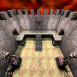

**Download** [`slaughterhouse.pk3`](install/slaughterhouse.pk3?raw=1) (831 KB) · [readme](maps/anthrax/1-slaughter-house/readme.txt) · `/map slaughterhouse`

March 2000 · 2–4 players · DM

The first map. *"Slaughter House was originaly only thought as a small map so that I could
lern to use the editor but I had so much fun playing the map that I decided finish it."*
Only a 128×128 levelshot survives.

### 2. ULTRA Cool — Anthrax

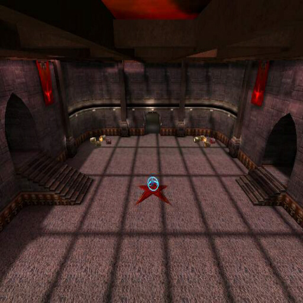

**Download** [`q3acdm1.pk3`](install/q3acdm1.pk3?raw=1) (648 KB) · [readme](maps/anthrax/2-ultra-cool/readme.txt) · `/map q3acdm1`

May 2000 · 2–4 players · DM, 1v1

*"This is one of the Coolest 1v1 maps, its a domination map this means that the person who
leads at the begining is most lightly to win."*

### 3. The Bunker — Anthrax

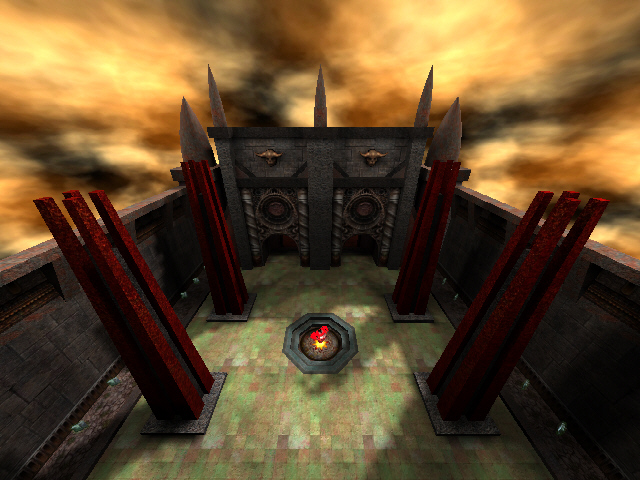

**Download** [`q3acdm4.pk3`](install/q3acdm4.pk3?raw=1) (769 KB) · [original release zip](archive/lvl-release-zips/q3acdm4.zip?raw=1) (760 KB) · [readme](maps/anthrax/3-the-bunker/readme.txt) · `/map q3acdm4`

May 2000 · 2–4 players · DM, 1v1 · [..::LvL review](https://lvlworld.com/review/id:1168)

Three rooms connected by two hallways and two teleporters, so the gameplay is fast. No Quad.
*"This is the coolest map I ever built."* — ..::LvL gave it 2.7/5: *"A quality level, just
nothing you haven't seen before."*

### 4. Free Fire Zone — Anthrax

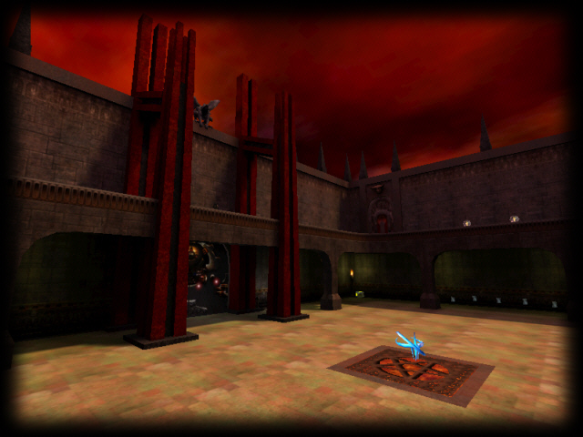

**Download** [`Q3AnthraxDM1.pk3`](install/Q3AnthraxDM1.pk3?raw=1) (931 KB) · [original release zip](archive/lvl-release-zips/q3anthraxdm1.zip?raw=1) (917 KB) · [readme](maps/anthrax/4-free-fire-zone/readme.txt) · `/map q3anthraxdm1`

January 2001 · 4–8 players · DM, TDM · [..::LvL review](https://lvlworld.com/review/id:936)

A TDM level in two parts: a big outer courtyard holding the Quad, RA and RG, and an inner
complex with everything else. Both worth defending. ..::LvL gave it 1.9/5.

### 5. Storm Sector 7 — Anthrax

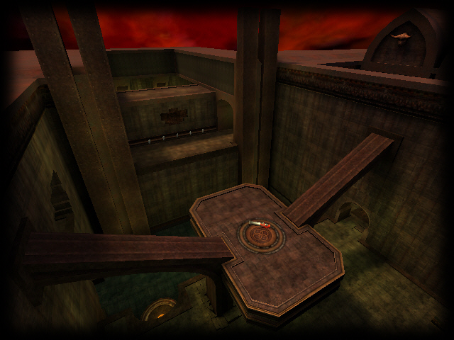

**Download** [`SS7.pk3`](install/SS7.pk3?raw=1) (2.9 MB) · [original release zip](archive/lvl-release-zips/ss7.zip?raw=1) (2.9 MB) · [readme](maps/anthrax/5-storm-sector-7/readme.txt) · `/map ss7`

**Map source** [`SS7-src.map`](maps/anthrax/5-storm-sector-7/source/SS7-src.map?raw=1) (1.4 MB) · [as zip](archive/ss7_src.zip?raw=1) (166 KB) · [licence](maps/anthrax/5-storm-sector-7/source/ss7-src_lvl-ogs-license.txt)

July 2002 · 2–7 players · DM, 1v1, TDM · **4.5/5 on [..::LvL](https://lvlworld.com/review/id:1401)**

The good one, and the only one whose editable `.map` source survives — see
[`source/`](maps/anthrax/5-storm-sector-7/source/). Textures and models by Evil Lair and
Mr. Clean.

> A creepy dark green Gothic map (…) great atmosphere, supported by unusual and original
> architecture, creepy lights and textures (…) Certainly not a map for mere mortals or
> newbies. **Download this map and get shot for an hour or two. Then do it again later.**
>
> — raptorE, ..::LvL

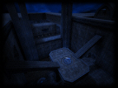 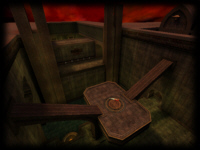 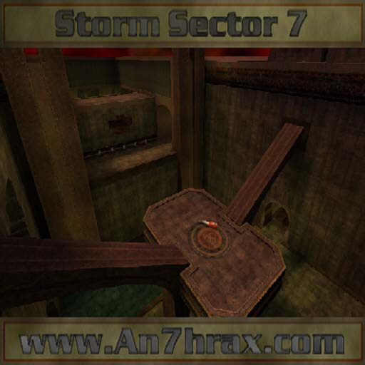

### 6. Pain's Room — Painstorm

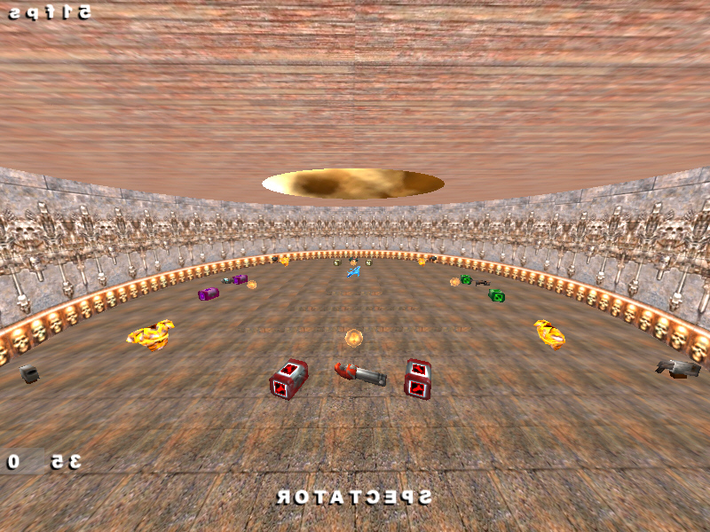

**Download** [`q3acdm3.pk3`](install/q3acdm3.pk3?raw=1) (600 KB) · [readme](maps/painstorm/pains-room/readme.txt) · `/map q3acdm3`

May 2000 · 5–6 players · DM

A round remake of an earlier square version. *"Building Time: 2 Days. Compail Time: 8 minutes
24 seconds. Bugs: oh, about 10! :-) OF COURSE NOT! Play IT! You will love it. I promise."*

---

## Lost

These were only ever hosted on `amoq.gnw.de` as `.zip`, and the Internet Archive crawled the
pages but never the files. **The screenshots below are all that is left of them.**

If anyone still has an old drive, backup CD or ZIP disk from back then, these are the
filenames to search for.

### Quake 3 — [`lost/quake3/`](lost/quake3/)

| | Map | Author | Look for |
|---|---|---|---|
| 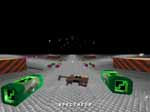 | **JumpingZone** | Painstorm | `q3acdm5.zip` |

Painstorm's first space map, and the first they put sounds into.

### Quake 2 — [`lost/quake2/`](lost/quake2/)

| | Map | Author | Look for |
|---|---|---|---|
| 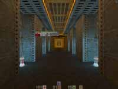 | **The Lost Station** (ACDM1) | Hell Soldier | `acdm1.zip` |
|  | **Lava Dome** (ACDM2) | Hell Soldier | `acdm2.zip` |
| 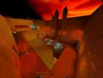 | **The Wasted Lands** (ACDM3) | Hell Soldier | `acdm3.zip` |
| 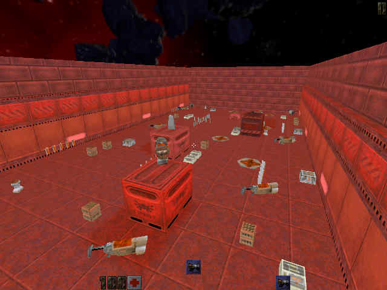 | **BlackDogs Railroom** (ACDM4) | Blackdog | `acdm4.zip` |
|  | **Hall of Rockets** (ACDM5) | Painstorm | `acdm5.zip` |

Full-size versions of four of these are in [`lost/quake2/`](lost/quake2/) — up to 1024×768.
Click to open:

[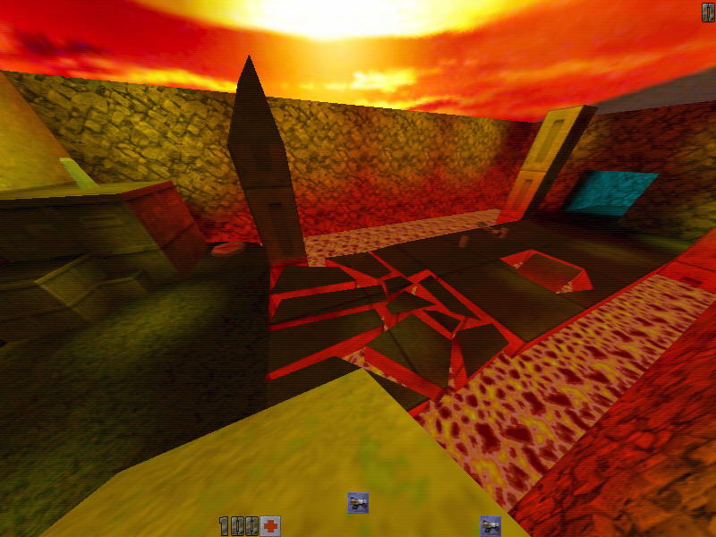](lost/quake2/acdm2-lava-dome-hellsoldier.jpg?raw=1)
[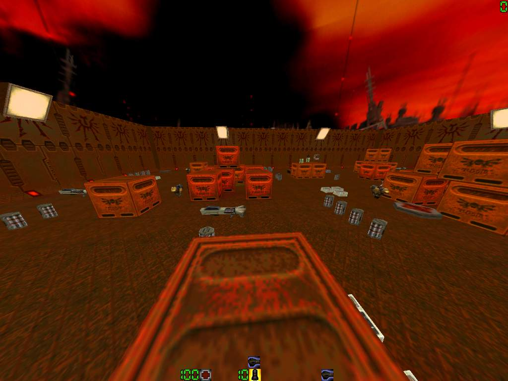](lost/quake2/acdm5-hall-of-rockets-painstorm.jpg?raw=1)

Also full size: [The Wasted Lands](lost/quake2/acdm3-the-wasted-lands-hellsoldier.jpg?raw=1) ·
[BlackDogs Railroom](lost/quake2/acdm4-blackdogs-railroom-blackdog.jpg?raw=1)

Also gone: `skins/amoq.zip` (AMOQ Skinpack by Blackdog & Hell Soldier), `files/digdogs.zip`,
`files/glq8_27.zip`, `files/pak9.zip`, `files/telewalter.rm`.

And one that was never finished — from the January 2002 news post:
*"I've also started work on TDM map but its not even near alpha."*

---

## The clan

Founded in 2000 by **Hell Soldier**, **Blackdog** and **Painstorm**. Quake 2 first; an internal
vote in March 2000 added Quake 3 — *"Mir san Vielseitisch"*. Anthrax joined 30 April 2000.
IRC: **#amoq** on QuakeNet.

Photos in [`clan/members/`](clan/members/), full profiles in
[`history/amoq-members.md`](history/amoq-members.md).

<table>
<tr>
<td align="center">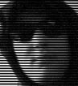<br><b>Hell Soldier</b><br>Pasquale Herzig</td>
<td align="center">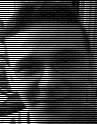<br><b>Blackdog</b><br>Sven Schneider</td>
<td align="center">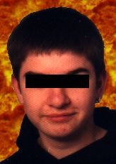<br><b>Painstorm</b><br>Christoph Fröbisch</td>
<td align="center">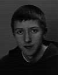<br><b>Anthrax</b><br>Fabian Barkhau</td>
</tr>
</table>

*(No photo of Blackybe survives.)*

| Nick | Name | Role | Rig (2001) |
|---|---|---|---|
| Hell Soldier | Pasquale Herzig | Clanleader, Q2 + Q3 team, clanwar organiser | P3 450, 256 MB, GeForce 2 MX |
| Blackdog | Sven Schneider | Q2 + Q3 team, server admin, co-webmaster | Athlon 500, 192 MB, TNT2 |
| Pain(storm) | Christoph Fröbisch | Q2 + Q3 team, clanwar organiser, *Clanreizer* | Duron 750@900, 128 MB, TNT2 Ultra |
| Blackybe | Bernd Schmidl | Webmaster | — |
| Anthrax | Fabian Barkhau | Mapper | Celeron 400, 128 MB |

Later members, from the news archive: **Specter** (Jul 2000), **Darth-Maul** and **Zeno**
(Aug 2000), **G1zZ** — who wrote most of the later clanwar reports. Thanked in three of the
map readmes: **Kampfkoloss** (Manuel Barkhau).

> *"Quake meine Religion. ID mein God. Mein Pc meine Kirche."* — Hell Soldier
>
> *"LAG mich!"* — Pain
>
> *"Hab ich vergessen!"* — Blackdog

The clan logo, donated by Phreakazoid (phr-gamez.de) in April 2000:

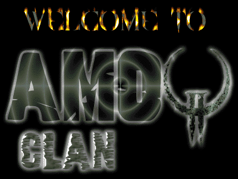

---

## History

The archived sites transcribed into readable Markdown. German is verbatim.

| File | What |
|---|---|
| [`history/amoq-news.md`](history/amoq-news.md) | **All 54 news posts**, Feb 2000 – Feb 2001 |
| [`history/amoq-clanwars.md`](history/amoq-clanwars.md) | Full clanwar results table |
| [`history/amoq-members.md`](history/amoq-members.md) | Member profiles, rigs, mottos, bios |
| [`history/amoq-lan-reviews.md`](history/amoq-lan-reviews.md) | LAN reviews: Bigone + BHN, 2000 |
| [`history/amoq-guestbook.md`](history/amoq-guestbook.md) | 60 surviving guestbook entries |
| [`history/an7hrax-news.md`](history/an7hrax-news.md) | Anthrax's own site news, 2002 |

### Clanwar record — 3 wins, 6 losses

| Game | Opponent | Total | |
|---|---|---|---|
| Q2 BG Clanwar | DVM | 119:29 | ✅ |
| Q3 RA3 Funwar | i23 | 20:3 | ✅ |
| Q3 RA3 Funwar | HellBlade | 16:17 | |
| Q3 RA3 GRAL | Chaos Incorporated | 16:22 | |
| Q3 RA3 GRAL | Das Kartell | 1:22 | |
| Q3 RA3 GRAL | Unmatched | 2:22 | |
| Q3 TDM Clanwar | Suck My Rocket | 119:316 | |
| Q2 BG Clanwar | NLC | 60:146 | |
| Q2 BG Clanwar | Goodfellas | 49:230 | |

League: **The-Leagues GRAL** (German Rocket Arena League). On 26 October 2000 Hell Soldier
announced AMoQ was withdrawing from the internet and from the running GRAL season, to continue
as a Darmstadt-area LAN clan.

It didn't quite end there. In February 2001 the clan was still playing **ESPL** RA3 2on2 and
TDM 2on2 under the name **Riedbauern** — RA3 was Hell + Blackybe, ranked 11th; TDM was Pain +
Blackdog.

### From the news archive

- **30 Apr 2000** — *"Welcome Anthrax. Wir haben ein neues Mitglied im einzig Rulenden Clan."*
- **22 Apr 2000** — the clan at **GiGa-Frag 2000** in Goddelau. *"Echt ne geile Party."*
- **13 Apr 2000** — new clan logo, donated by Phreakazoid (phr-gamez.de)
- **18 Jul 2000** — *"AMOQ im IRC"* — #amoq on QuakeNet (irc.barrysworld.com)
- **15 Dec 2000** — Blackybe forced to build spam protection into the guestbook after
  sustained abuse. Anthrax's reply the next day is… direct.
- **18 Feb 2001** — *"Das GNW ist pleite"* — the host went bankrupt. That is why the site, and
  the map downloads with it, disappeared.

---

## Sources

**Everything is already in this repo** — the links in this section are provenance, not
downloads. Use the [Quick start](#quick-start) table, or clone:

```sh
git clone https://github.com/F483/amoq-archive.git
```

The external sites are recorded here so the chain of custody is verifiable, and because two
of them could disappear at any time.

### ..::LvL — <https://lvlworld.com>

Still online after 25 years. The three maps that got a public release.
Author page: <https://lvlworld.com/author/An7hrax>

| Map | Review | Download |
|---|---|---|
| Free Fire Zone | <https://lvlworld.com/review/id:936> | <https://lvlworld.com/download/id:936> |
| The Bunker | <https://lvlworld.com/review/id:1168> | <https://lvlworld.com/download/id:1168> |
| Storm Sector 7 | <https://lvlworld.com/review/id:1401> | <https://lvlworld.com/download/id:1401> |

SS7 `.map` source, under the ..::LvL Open Game Source License:
<https://sourceforge.net/projects/lvl/files/lvl-ogs/ss7_src/ss7_src.zip/download>

`ss7.zip` sha256 verified against the ..::LvL listing:
`9d02dd7a8ade7215a6a9bb323805c6a46c14271658c46fcb8b56ef3a09cd758c`

### Internet Archive — `amoq.gnw.de`

**The only place Slaughter House, ULTRA Cool and Pain's Room survived.** Full mirror of every
page and image ever captured: [`archive/amoq-site/`](archive/amoq-site/) — start at
[`index.php3`](archive/amoq-site/index.php3), [`maps.htm`](archive/amoq-site/maps.htm),
[`members.htm`](archive/amoq-site/members.htm), [`clanwars.htm`](archive/amoq-site/clanwars.htm).

- Maps — <https://web.archive.org/web/20010309204437/http://amoq.gnw.de/maps.htm>
- News, all 54 — <https://web.archive.org/web/2001/http://amoq.gnw.de/cgi-bin/newspro/viewnews.cgi?newsall>
- Clanwars — <https://web.archive.org/web/2001/http://amoq.gnw.de/clanwars.htm>
- Members — <https://web.archive.org/web/20010806110710/http://amoq.gnw.de/members.htm>
- Everything captured — <http://web.archive.org/cdx/search/cdx?url=amoq.gnw.de*&collapse=urlkey&fl=timestamp,original,statuscode>

Raw map files — note the `id_`, which skips the Wayback toolbar and returns the real bytes:

```
https://web.archive.org/web/20010311195139id_/http://amoq.gnw.de/maps/slaughterhouse.pk3
https://web.archive.org/web/20010311193944id_/http://amoq.gnw.de/maps/q3acdm1.pk3
https://web.archive.org/web/20010311194901id_/http://amoq.gnw.de/maps/q3acdm3.pk3
https://web.archive.org/web/20010311194829id_/http://amoq.gnw.de/maps/q3acdm4.pk3
```

The later clan domain `www.amoq-clan.de` (from March 2000) and `amoq.blackybe.de` only ever
had their redirect pages captured.

### Internet Archive — `an7hrax.com`

Anthrax's own site, 2002–2005. Full mirror: [`archive/an7hrax-site/`](archive/an7hrax-site/) —
start at [`Maps.html`](archive/an7hrax-site/Maps.html), [`News.html`](archive/an7hrax-site/News.html),
[`Files.html`](archive/an7hrax-site/Files.html).
Pages and 640×480 screenshots survived; no map files were ever crawled.

- Maps, final version — <https://web.archive.org/web/20050214000557/http://an7hrax.com/Maps.html>
- News — <https://web.archive.org/web/2003/http://an7hrax.com/News.html>
- Everything captured — <http://web.archive.org/cdx/search/cdx?url=an7hrax.com&matchType=domain&collapse=urlkey&fl=timestamp,original>

Also mirrored: **doggy.an7hrax.com** — *digital-dogart* by dog (Blackdog), 2003, hosted on
Anthrax's domain and still listing #amoq as its IRC channel.

Earlier home: `www.planetanthrax.de` → `anthrax.exit.mytoday.de`
(<https://web.archive.org/web/20010725150656/http://www.planetanthrax.de/>).

### Dead ends

Searched, came up empty — so nobody has to repeat it.

- **Demos.** The news post of 24 Feb 2000 says demos of the clanwars vs Goodfellas and NLC
  went online under Clanwars → Details. `clanwars.htm` was captured; none of the per-war
  Details pages were, and no `.dm2`/`.dm3` file exists anywhere. Gone.
- **Videos.** None ever existed, as far as either site shows.
- `ws.q3df.org` / `q3df.org` — behind Cloudflare, unreachable programmatically
- `quake3world.com` — 403
- FilePlanet, the download host both sites linked to — long dead
- idgames2 Quake 2 mirrors (gwdg.de, gamers.org, lip6.fr) — dead or 403; the Q2 clan maps are
  in no public archive
- `clanintern.de` clan 567, The-Leagues, ESPL, Riedbauern — no league tables archived
- `blackybe.de`, `phr-gamez.de`, `chaosquake.de` — nothing relevant
- GameBanana, ModDB, MapRaider — nothing
- None of the other AMOQ members appear in the ..::LvL author list (984 names, all checked)

---

## A note on the mirrors

The site mirrors in [`archive/`](archive/) are byte-exact captures from the Internet Archive,
with one deliberate exception: the **email addresses and ICQ numbers of the other members**
have been replaced with `[email removed]` / `[ICQ removed]`, in both the mirrored HTML and the
Markdown transcriptions. They were public on a clan website in 2001; they should not be sitting
in a search-indexed repository in 2026.

Everything else is untouched — names, nicknames, photos, bios, spelling mistakes and all. The
unredacted originals are still one Wayback link away for anyone who needs them.

---

## Folder layout

```
install/                    all 6 .pk3 — drop into baseq3, done
maps/
  anthrax/                  one folder per map: .pk3, readme.txt, screenshots/
    5-storm-sector-7/
      source/               the editable SS7-src.map
  painstorm/
    pains-room/
lost/                       screenshots of the 6 maps whose files did not survive
clan/
  members/                  member photos
  logo/                     clan logo and title graphic
history/                    the sites transcribed to Markdown
archive/
  amoq-site/                full mirror of amoq.gnw.de (61 files)
  an7hrax-site/             full mirror of an7hrax.com (45 files)
  lvl-release-zips/         the 3 untouched ..::LvL release zips
  ss7_src.zip               untouched SS7 source zip
```

---

## Build notes

From the readmes. Quake III Radiant 181, later GtkRadiant with Ydnar's Q3MAP2.

Free Fire Zone compiled in 30 minutes on a **Celeron 400 with 128 MB RAM**. Pain's Room in
8 minutes 24 seconds on an **AMD K6-2 450 with 64 MB**.

Storm Sector 7 uses textures and models by **Evil Lair** and **Mr. Clean**, with testing by
**Chaos** (chaosquake.de), **Hellz** and **Kampfkoloss**.

One inconsistency: the clan site calls ULTRA Cool *"my first map"*, but the readmes say
Slaughter House came first — `q3acdm1.txt` lists *"Previous Maps: Slaughter House"* and
`SlaughterHouse.txt` lists *"Previous Maps: None"*. The readmes are probably right.

---

## Licence

The original readmes apply, and they ship in each map folder.

In short: **Slaughter House**, **ULTRA Cool**, **The Bunker** and **Free Fire Zone** may be
used as a base for new levels and redistributed online, as long as the readme goes with them
unmodified. No CDs, no commercial use without permission.

**Storm Sector 7** is stricter — no reuse as a base — *except* the `.map` source, which was
released under the ..::LvL Open Game Source License. Make your own versions.

**Pain's Room** is Painstorm's work, included here with the same intent as everything else:
preservation.
